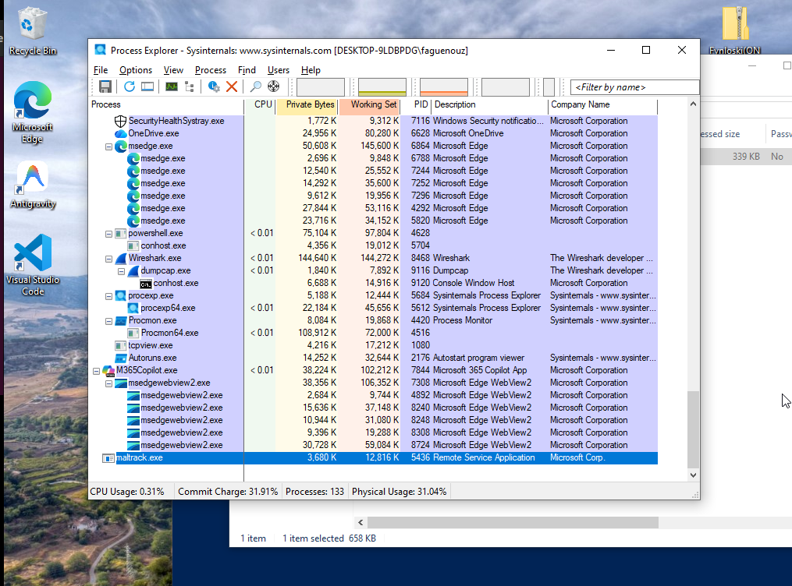
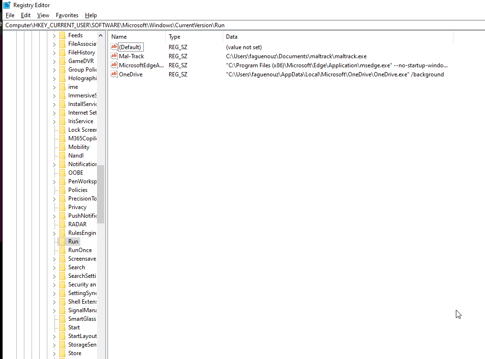
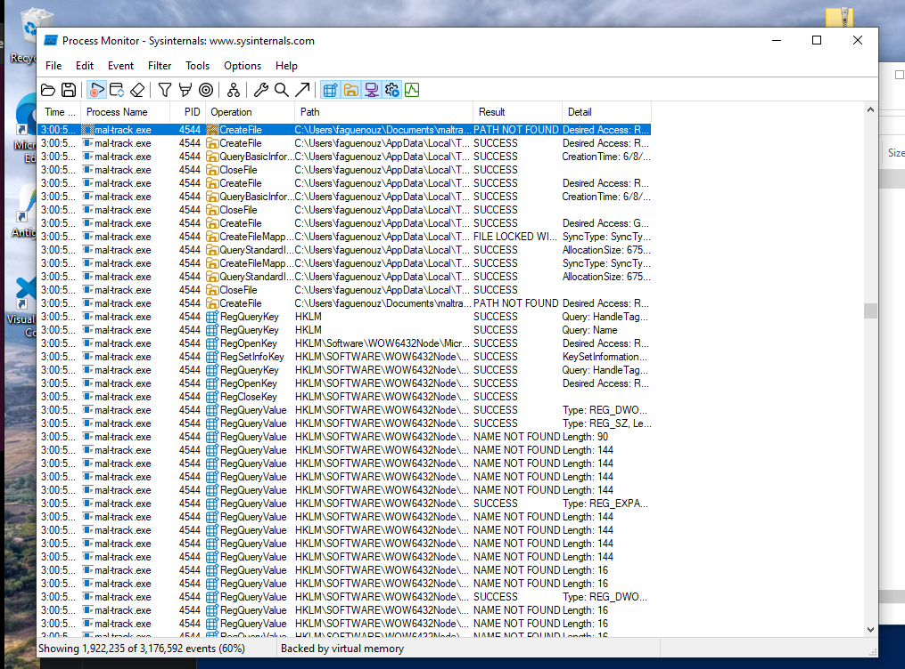
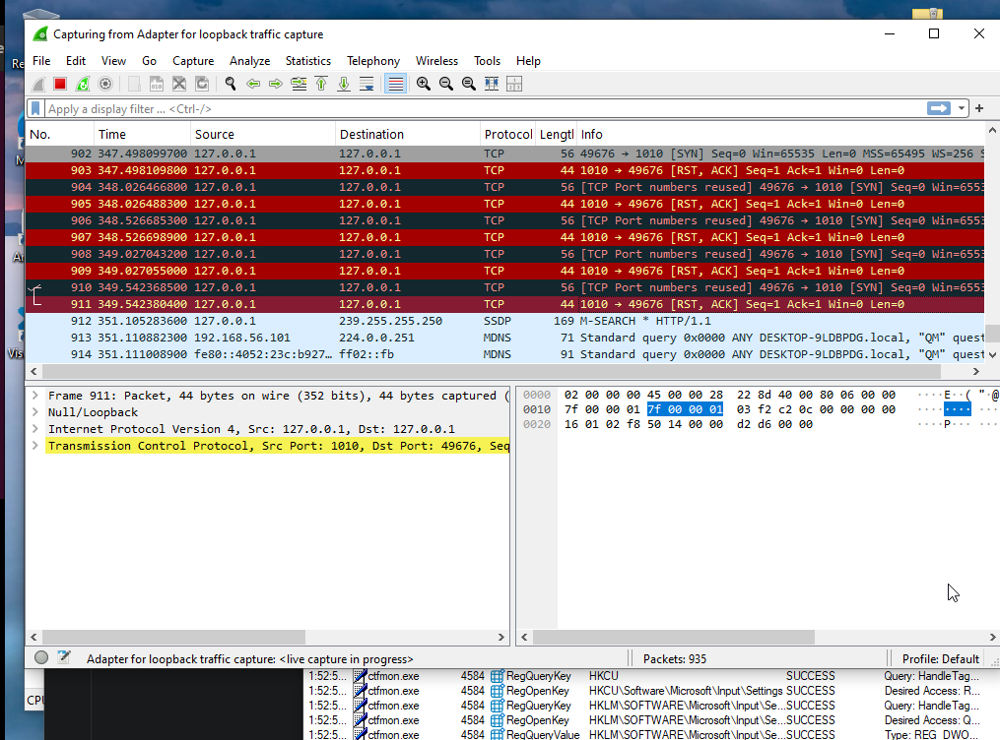
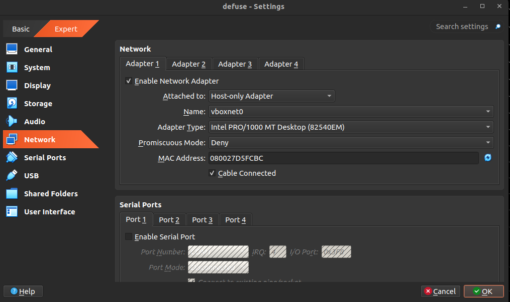
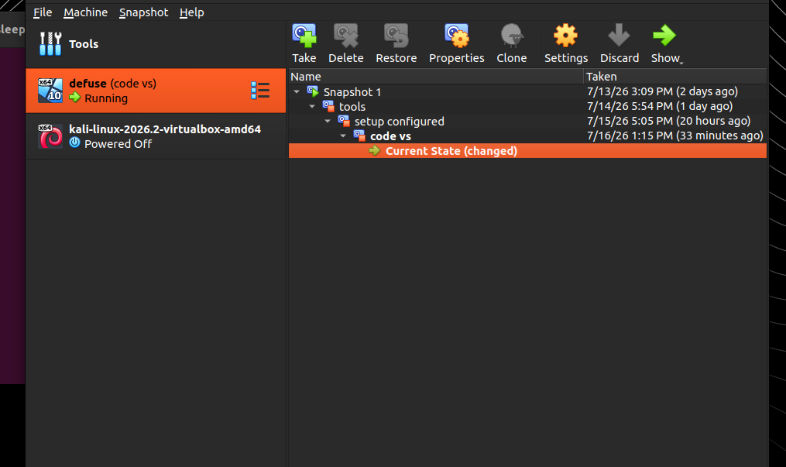
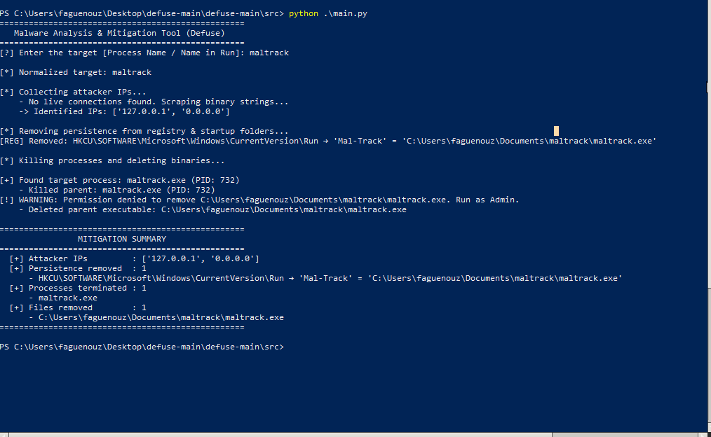

# Defuse – Malware Analysis and Mitigation of Mal-Track (Win32/Fynloski)

## 1. Program Explanation

This project implements a PowerShell-based malware remover for a Windows malware sample named **Mal-Track**, based on the Win32/Fynloski family.  
The tool is designed to:

- Identify the running malware process by name (e.g. `Mal-Track`, `maltrack`, `maltrack.exe`).
- Extract the attacker IP address used for communication (loopback in this lab: `127.0.0.1`).
- Remove registry-based persistence from common Run/RunOnce keys.
- Kill the malware process (and its child processes) and delete its executable and working directory.

### Core Modules

---

## Core Modules

The project is organized into several PowerShell modules, each responsible for a specific part of the malware mitigation process.

### Defuse.ps1

The main entry point of the application. This script verifies that it is running with administrator privileges, loads all required modules, validates the target malware name, and orchestrates the complete mitigation workflow. It coordinates every stage of the process, from process discovery to the final verification report.

---

### Config.ps1

Contains the global configuration used throughout the project. It defines constants such as:

- Registry locations to scan for persistence.
- Windows Startup folders to inspect.
- Console color definitions.
- Timing values, such as the delay between process termination and file deletion.

Keeping these values in a dedicated configuration file makes the project easier to maintain and update.

---

### Helpers.ps1

Provides utility functions shared across multiple modules.

Its responsibilities include:

- Normalizing process and file names by removing the `.exe` extension, special characters, and converting names to lowercase.
- Safely deleting files and directories while supporting **Dry Run** mode and error handling.
- Displaying the program banner and common console output.

This module avoids duplicating common functionality across the project.

---

### ProcessDiscovery.ps1

Responsible for discovering the malware on the system.

It:

- Searches running processes that match the target malware name.
- Retrieves the executable path of each matching process.
- Recursively identifies all child processes so that the complete process tree can be terminated during mitigation.

---

### NetworkCollector.ps1

Collects network information associated with the malware.

It inspects established TCP connections belonging to the identified malware processes and extracts the unique remote IP addresses. This provides visibility into the systems with which the malware is communicating.

---

### PersistenceManager.ps1

Removes mechanisms that allow the malware to survive a system reboot.

This module:

- Searches common **Run** and **RunOnce** registry keys and removes matching persistence entries.
- Scans Windows Startup folders and deletes malicious startup files.
- Supports **Dry Run** mode, allowing changes to be simulated without modifying the system.

---

### TerminationManager.ps1

Handles process termination.

After all related parent and child processes have been identified, this module safely terminates each process while handling processes that may have already exited. Child processes are terminated before their parents to ensure a cleaner shutdown.

---

### FileCleaner.ps1

Removes malware files from disk.

It deletes the malware executable and, when appropriate, removes its parent directory if it belongs exclusively to the malware. All deletions are performed through the shared helper functions to provide consistent logging, error handling, and Dry Run support.

---

### Verifier.ps1

Performs the final verification phase.

After mitigation is complete, it:

- Checks whether any malware processes are still running.
- Verifies that registry persistence entries have been removed.
- Generates a mitigation summary showing the actions performed, including terminated processes, removed files, deleted registry entries, observed network endpoints, and the overall cleanup status.

---

### Script Overview

                Defuse.ps1
                     │
                     ▼
              Load all modules
                     │
                     ▼
          Normalize target name
                     │
                     ▼
            ProcessDiscovery.ps1
        Find the malware process
                     │
                     ▼
          NetworkCollector.ps1
         Record remote IP addresses
                     │
                     ▼
           ProcessDiscovery.ps1
         Find executable paths
                     │
                     ▼
           ProcessDiscovery.ps1
            Find child processes
                     │
                     ▼
            PersistenceManager.ps1
       Remove registry & startup persistence
                     │
                     ▼
           TerminationManager.ps1
        Kill all related processes
                     │
                     ▼
              FileCleaner.ps1
      Delete malware files/directories
                     │ 
                     ▼
               Verifier.ps1
      Verify cleanup and print summary

---

## 2. Walkthrough: Analysis and Eradication

### Environment Setup

1. Created a dedicated Windows virtual machine in VirtualBox (`defuse` VM).
2. Configured networking as **host-only** to avoid uncontrolled internet access.
3. Added the malware sample (`Fynloski(ON VM ONLY).zip`) to antivirus exclusions to prevent automatic deletion.
4. Took an initial VM snapshot (`code vs`) to allow safe rollback.

Tools used:

- Process Monitor (Sysinternals) – dynamic behavior (file, registry, process activity).
- Process Explorer (Sysinternals) – process tree, parent/child relationships.
- Registry Editor – verifying persistence keys.
- Wireshark – capturing local network traffic and attacker IP.
- PowerShell + VS Code – developing the remover.
- VirtualBox – isolation and snapshot management.

### Static & Dynamic Analysis

1. **Execution and Process Discovery**
   - Launched the malware executable (`maltrack.exe`).
   - Observed a process named `maltrack.exe` in Process Explorer with path:  
     `C:\Users\faguenouz\Documents\maltrack\maltrack.exe`.
   - Identified parent/child relationships and working directory (`C:\Windows\system32`).

   **Process Explorer:**
   

2. **Registry Persistence**
   - Using Process Monitor + Registry Editor, observed creation of a Run entry:
     - Key: `HKCU\SOFTWARE\Microsoft\Windows\CurrentVersion\Run`
     - Name: `Mal-Track`
     - Data: `C:\Users\faguenouz\Documents\maltrack\maltrack.exe`

   **Registry Editor:**
     
   **Process Monitor:**
   

3. **Network Activity and Attacker IP**
   - Captured traffic with Wireshark on the loopback interface.
   - Observed repeated TCP connections to `127.0.0.1` (local C2 simulation for the lab).
   - The project defines the attacker IP as `127.0.0.1`.

   **Wireshark:**
   

4. **VM Isolation and Safety**
   - Verified no external internet connections from the VM.
   - Confirmed host-only network configuration.

   **VM Network:**
     
   **VM Snapshot:**
   

### Eradication Using the PowerShell Tool

## Usage

1. Ran the remover from an elevated PowerShell in the VM:

Run **PowerShell as Administrator**, navigate to the project directory, and execute:

```powershell
Set-ExecutionPolicy -Scope Process -ExecutionPolicy Bypass
.\Defuse.ps1 -Target "maltrack"
```

2. To simulate the mitigation without making any changes:

```powershell
.\Defuse.ps1 -Target "maltrack" -DryRun
```
## Result of excution 
  **output :**
   

3. The tool:

````
- Normalized `maltrack` and matched both `maltrack.exe` and registry name `Mal-Track`.
- Extracted attacker IPs (loopback packets → `127.0.0.1`).
- Removed the persistence entry:

  ```text
  [REG] Removed: HKCU\SOFTWARE\Microsoft\Windows\CurrentVersion\Run → 'Mal-Track' = 'C:\Users\faguenouz\Documents\maltrack\maltrack.exe'
  ```

- Killed the malware process and deleted the executable:

  ```text
  [PROC] Found target process: maltrack.exe (PID ...)
  [PROC] Killed parent maltrack.exe at C:\Users\faguenouz\Documents\maltrack\maltrack.exe
  ```

- Skipped deletion of protected system directories (e.g. `C:\Windows\system32`), logging access denied safely.

**Output of the program:**


4. Verified eradication:

- `maltrack.exe` no longer present in Process Explorer.
- `Mal-Track` entry removed from `HKCU\...\Run`.
- `C:\Users\faguenouz\Documents\maltrack\maltrack.exe` deleted.
- Program summary showed 1 process terminated, 1 registry persistence entry removed, and 2 paths cleaned.

---

## 3. Remediation & Recommendations

To prevent similar infections in a real environment:

- **System Hardening**
- Enforce least privilege; avoid users with unnecessary admin rights.
- Enable and maintain up‑to‑date endpoint protection (AV/EDR).
- Restrict execution from user profile directories (e.g. `Downloads`, `Documents`) via AppLocker or similar.

- **Monitoring & Detection**
- Monitor Run/RunOnce keys for suspicious entries pointing to user‑profile EXEs.
- Flag unusual processes with names like `maltrack.exe` running from non‑standard locations.
- Inspect loopback and unexpected outbound connections for C2 behavior (e.g. beaconing).

- **User Awareness**
- Train users to avoid executing unknown binaries from email or web downloads.
- Implement attachment scanning and sandboxing for suspicious executables.

- **Incident Response**
- Maintain playbooks for:
 - Process isolation and termination.
 - Persistence hunting (registry, startup folders, scheduled tasks).
 - Safe acquisition of forensic artifacts (logs, memory, disk).

````
---

## 4. Malware Mitigation Report Email


Dear Security Team,

I am writing to report the successful analysis and mitigation of the **Mal-Track** malware sample, identified as part of an educational malware analysis exercise involving the **Win32/Fynloski** family. The objective was to analyze the malware's behavior, identify its persistence mechanisms, and develop a PowerShell-based mitigation tool capable of safely removing the infection from a controlled Windows virtual machine.

### Summary of Findings

Dynamic analysis showed that the malware executed as **maltrack.exe** and established persistence by creating a **Run** registry entry under the current user's profile. This allowed the malware to launch automatically whenever the user logged into Windows.

Network monitoring also revealed outbound TCP connections to **127.0.0.1**, which served as the simulated command-and-control (C2) endpoint within the isolated laboratory environment.

### Mitigation Performed

A custom PowerShell tool, **Defuse**, was developed to automate the malware removal process. The tool performed the following actions:

* Located all running instances of the malware by normalizing the supplied process name.
* Identified any child processes associated with the malware.
* Collected the remote network endpoints used by the malware.
* Removed persistence from the monitored Windows **Run** and **RunOnce** registry keys.
* Removed malicious startup folder entries.
* Terminated the malware process tree.
* Deleted the malware executable and its associated directory when appropriate.
* Performed a post-remediation verification to confirm that no monitored persistence entries or running malware processes remained.

### Proof of Eradication

The mitigation was successfully validated through the following observations:

* The **maltrack.exe** process was no longer present after execution.
* The malicious registry persistence entry was removed.
* The malware executable was deleted from the system.
* No monitored registry persistence remained following verification.
* The mitigation summary confirmed successful process termination and cleanup.

### Attacker Information

The malware communicated with the following endpoint during analysis:

**Remote IP Address:** `127.0.0.1`

This address represents the loopback interface used to simulate command-and-control communication within the isolated laboratory environment. No external network communication occurred during testing.

The analysis and mitigation were performed entirely inside an isolated Windows virtual machine using host-only networking to ensure that the malware could not interact with external systems. This approach provided a safe environment for observing malicious behavior while preventing unintended propagation.

Please let me know if you require additional artifacts, including execution logs, screenshots, packet captures, or the source code for the mitigation tool.

Kind regards,

**Aguenouz Fahd**
Malware Analyst
[faguenouz@gmail.com](mailto:faguenouz@gmail.com)


---

## 5. Ethical Hacking Report

1. **Importance of a Controlled Environment**
   - All analysis was performed inside an isolated Windows VM with host-only networking.
   - Snapshots were used to revert the environment to a clean state after each test.
   - This isolation ensures the malware cannot escape to the host or the wider network.

2. **Legal and Ethical Boundaries**
   - The malware sample was used strictly for educational purposes as part of a structured lab.
   - No attempts were made to deploy or test the malware outside the controlled VM.
   - All actions focused on understanding, detecting, and removing malicious behavior, aligned with ethical hacking practices.

3. **Risks of Executing Malware Outside Isolation**
   - Running malware on a production or personal system can lead to data theft, system compromise, and legal consequences.
   - Malware can pivot to other devices on the network, escalate privileges, or exfiltrate sensitive information.
   - Proper isolation (VMs, sandboxes) and strict handling policies are mandatory when working with live samples.

---
